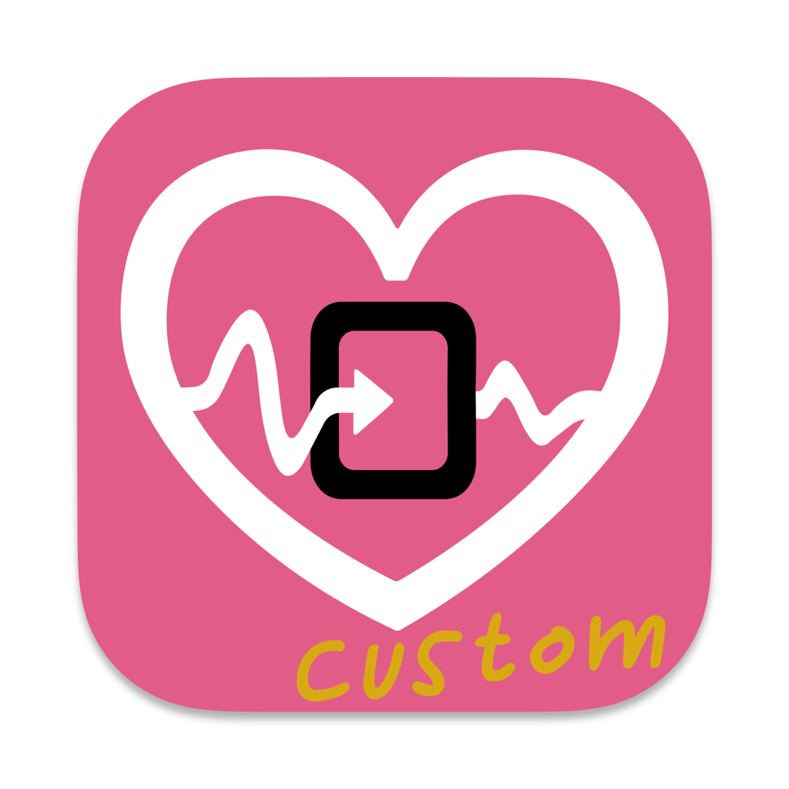
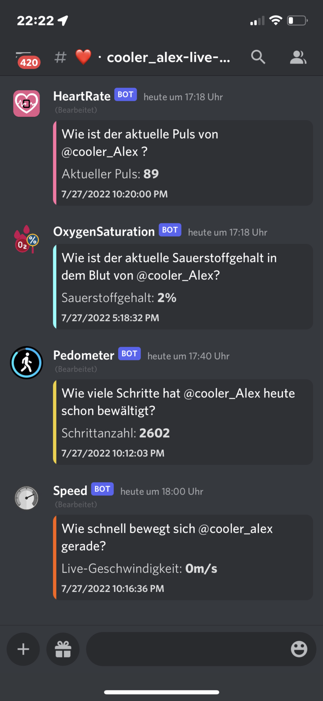
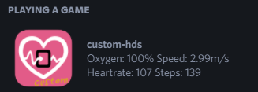
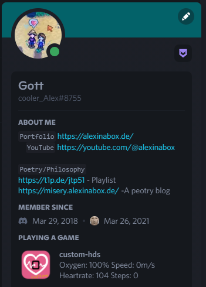
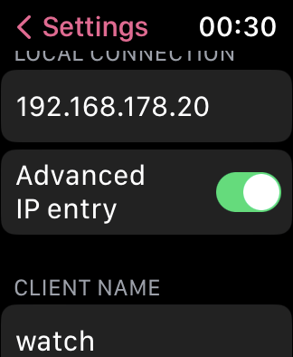

[![Contributors][contributors-shield]][contributors-url]
[![Forks][forks-shield]][forks-url]
[![Stargazers][stars-shield]][stars-url]
[![Issues][issues-shield]][issues-url]
[![MIT License][license-shield]][license-url]


<!-- PROJECT LOGO -->
<br />
<div align="center">
  <a href="https://github.com/alexinabox/custom-hds">
    
  </a>

<h3 align="center">custom-hds</h3>

  <p align="center">
    custom-hds - built for <a href="https://github.com/Rexios80/Health-Data-Server-Overlay/">Health-Data-Server</a>
    <br />
    <a href="https://github.com/alexinabox/custom-hds/issues">Report Bug</a>
    ·
    <a href="https://github.com/alexinabox/custom-hds/issues">Request Feature</a>
  </p>
</div>


<!-- TABLE OF CONTENTS -->
<details>
  <summary>Table of Contents</summary>
  <ol>
    <li>
      <a href="#about-the-project">About The Project</a>
      <ul>
        <li><a href="#built-with">Built With</a></li>
      </ul>
    </li>
    <li>
      <a href="#getting-started">Getting Started</a>
      <ul>
        <li><a href="#prerequisites">Prerequisites</a></li>
        <li><a href="#installation">Installation</a></li>
        <li><a href="#daemonize">Daemonize</a></li>
      </ul>
    </li>
    <li><a href="#usage">Usage</a></li>
    <li><a href="#roadmap">Roadmap</a></li>
    <li><a href="#contributing">Contributing</a></li>
    <li><a href="#license">License</a></li>
    <li><a href="#contact">Contact</a></li>
    <li><a href="#acknowledgments">Acknowledgments</a></li>
  </ol>
</details>


<!-- ABOUT THE PROJECT -->
## About The Project
<div align="left">
  <a href="https://github.com/AlexInABox/custom-hds/tree/main/assets">
    
    
    
  </a>
</div>


<p align="right">(<a href="#readme-top">back to top</a>)</p>


### Built With

* [![Express][Express.js]][Express-url]

<p align="right">(<a href="#readme-top">back to top</a>)</p>


<!-- GETTING STARTED -->
## Getting Started

Funny project. Easy to use!

### Prerequisites

This project requires NodeJS (version 8 or later) and NPM. Node and NPM are really easy to install. To make sure you have them available on your machine, try running the following command.

```sh
$ npm -v && node -v
6.4.1
v8.16.0
```

(your output should look something like this if and only if you have those tools installed. if not, consider installing them! duh)

### Installation

1. Clone the repo
   ```sh
   git clone https://github.com/alexinabox/custom-hds
   ```
2. Install NPM packages
   ```sh
   npm install
   ```
3. Edit the **config.js** file!  (dont copy the following as a whole since comments dont work in json syntax)

```json
{
    "port": 3476, <-- port goes here (left as default in most cases)
    "timezone": "Europe/Amsterdam",  <-- your timezone goes here
    "discordAppID": "1033806008008581240",  <---- leave as default for fancy heartrate icons (or create your own application at https://https://discord.com/developers)
    "webhookURL": "https://discord.com/api/webhooks/<id>/<secret>",  <--- add your discord webhook like this
    "heartRateMessageID": "<id>",  <---- message ID of the heartRate message
    "oxygenSaturationMessageID": "<id>",  <---- message ID of the oxygen message
    "pedoMeterMessageID": "<id>",  <---- message ID of the steps message
    "speedMessageID": "<id>",  <---- message ID of the speed message
    "secretPass": "secretPass"  <--- a secret pass like this (use case: http://example.com/secretPass)  ((leave blank when using locally or you just dont care))
  }
```

4. open the desired port on your firewall (optional) 

5. start the server:
   ```sh
   node index.js
   ```
   
6. in the watch: click on advanced ip entry and add the ip your custom-hds server is running on

<div align="left">
  <a href="https://github.com/AlexInABox/custom-hds/tree/main/assets">
    
  </a>
</div>
   
7. profit

<p align="right">(<a href="#readme-top">back to top</a>)</p>

### Daemonize

The daemonization of this application ensures that it always runs in the background and also starts itself on boot! 


<br>

!!! **WARNING** !!! Before you deamonize this application, make sure to at least run custom-hds once on your machine using the commands above! 

<br>

**Create** the windows backround service:
   ```sh
   cd misc/
   node createWinSvc.js
   ```

**Remove** the windows backround service:
   ```sh
   cd misc/
   node removeWinSvc.js
   ```

<p align="right">(<a href="#readme-top">back to top</a>)</p>


<!-- USAGE EXAMPLES -->
## Usage

Like you can have your health data inside discord webhooks now. wooho.

_For more examples, please refer to the **non existent** [Documentation](https://example.com)_

<p align="right">(<a href="#readme-top">back to top</a>)</p>


<!-- ROADMAP -->
## Roadmap

- [ ] dynamic icon showing the heartrate as a neat graphic (50% done)
- [ ] endpoint for iPhone Focus status
- [ ] turing machine
    - [ ] my teacher would love it!

See the [open issues](https://github.com/alexinabox/custom-hds/issues) for a full list of proposed features (and known issues).

<p align="right">(<a href="#readme-top">back to top</a>)</p>


<!-- CONTRIBUTING -->
## Contributing

Bla Bla Bla learning bla bla bla open-source bla bla bla **greatly appreciated**.

If you have a suggestion that would make this better, please fork the repo and create a pull request. You can also simply open an issue with the tag "enhancement".
Don't forget to give the project a star! Thanks again!

1. Fork the Project
2. Create your Feature Branch (`git checkout -b feature/AmazingFeature`)
3. Commit your Changes (`git commit -m 'Add some AmazingFeature'`)
4. Push to the Branch (`git push origin feature/AmazingFeature`)
5. Open a Pull Request (write something neat so i know whats goin on)

<p align="right">(<a href="#readme-top">back to top</a>)</p>


<!-- LICENSE -->
## License

Distributed under the GNU General Public License v3.0 License. See `LICENSE.txt` for more information.

<p align="right">(<a href="#readme-top">back to top</a>)</p>


<!-- CONTACT -->
## Contact

AlexInABox - [@wilder_Alex__](https://twitter.com/wilder_Alex__) - main@alexinabox.de

Project Link: [https://github.com/alexinabox/custom-hds](https://github.com/alexinabox/custom-hds)

Website: [https://alexinabox.de](https://alexinabox.de)

<p align="right">(<a href="#readme-top">back to top</a>)</p>


<!-- ACKNOWLEDGMENTS -->
## Acknowledgments

* []() big thanks to [Rexios80](https://github.com/Rexios80) for creating [HDS](https://github.com/Rexios80/hds_overlay) in the first place.

<p align="right">(<a href="#readme-top">back to top</a>)</p>


<!-- MARKDOWN LINKS & IMAGES -->
<!-- https://www.markdownguide.org/basic-syntax/#reference-style-links -->
[contributors-shield]: https://img.shields.io/github/contributors/alexinabox/custom-hds.svg?style=for-the-badge
[contributors-url]: https://github.com/alexinabox/custom-hds/graphs/contributors
[forks-shield]: https://img.shields.io/github/forks/alexinabox/custom-hds.svg?style=for-the-badge
[forks-url]: https://github.com/alexinabox/custom-hds/network/members
[stars-shield]: https://img.shields.io/github/stars/alexinabox/custom-hds.svg?style=for-the-badge
[stars-url]: https://github.com/alexinabox/custom-hds/stargazers
[issues-shield]: https://img.shields.io/github/issues/alexinabox/custom-hds.svg?style=for-the-badge
[issues-url]: https://github.com/alexinabox/custom-hds/issues
[license-shield]: https://img.shields.io/github/license/alexinabox/custom-hds.svg?style=for-the-badge
[license-url]: https://github.com/alexinabox/custom-hds/blob/master/LICENSE.txt
[product-screenshot]: assets/showcase1.png
[Express.js]: https://img.shields.io/badge/express.js-000000?style=for-the-badge&logo=expressdotjs&logoColor=white
[Express-url]: https://expressjs.com
